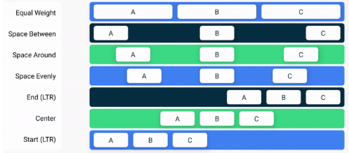

# Kotlin and jetpack compose Start

## **Theory**

Compose apps transform data into UI by calling composable functions. If your data changes,
Compose re-executes these functions with the new data, creating an updated UI—this is
**called recomposition**. Compose also looks at what data is needed by an individual composable
so that it only needs to recompose components whose data has changed and skip recomposing those
that are not affected.

Composable functions can executed in any order. Compose can automatically recognise, that some
UI elements have more priority than others, so it can render them first. For example, in multi
screen in tab layout, the main screen will automatically, but this execution could be changed.

Composable functions can run in parallel.

Recomposition skips as much as possible. Compose will recompose only the elements that have to
be updated. If some state will not need recomposition, it will be skipped. Even if the state
changes only one parameter (only text, (even if it had header,text,footer)) it will recompose
only that element(text for example upper).

If parameter changes before recomposition will be done - it will be stopped and rerun with new 
parameter.

Composable functions are run frequently

To save composable state it should be used `MutableState` and `remember`. they will
AUTOMATICALLY track changes.

In compose there is three basic standard layout elements in Compose are Column, Row and Box.
They are Composable functions that take Composable content, so you can place items inside.
For example, each child inside of a Column will be placed vertically.

In Composable functions, state that is read or modified by multiple functions should live in a
common ancestor—this process is called state hoisting. To hoist means to lift or elevate.

Making state hoistable avoids duplicating state and introducing bugs, helps reuse composables,
and makes composables substantially easier to test. Contrarily, state that doesn't need to be
controlled by a composable's parent should not be hoisted. The source of truth belongs to whoever
creates and controls that state.

If you run the app on a device, click on the buttons and then you rotate, the onboarding screen
is shown again. The `remember` function works only as long as the composable is kept in the
Composition. When you rotate, the whole activity is restarted so all state is lost. This also
happens with any configuration change and on process death.
Instead of using `remember` you can use `rememberSaveable`. This will save each state surviving
configuration changes (such as rotations) and process death.

The `spring` spec does not take any time-related parameters. Instead it relies on physical
properties (damping and stiffness) to make animations more natural. Any animation created with
`animate*AsState` is interruptible. This means that if the target value changes in the middle of
the animation, `animate*AsState` restarts the animation and points to the new value.

The `Text` composable in the example above sets a new `TextStyle`. You can create your own
`TextStyle`, or you can retrieve a theme-defined style by using `MaterialTheme.typography`, which
is preferred. This construct gives you access to the Material-defined text styles, such as
`displayLarge, headlineMedium, titleSmall, bodyLarge, labelMedium` etc. In your example, you use
the headlineMedium style defined in the theme.


For a `Column`, you decide how its children should be aligned horizontally. The options are:
`Start` * `CenterHorizontally` * `End`

For a `Row`, you set the vertical alignment. The options are similar to those of the Column:
`Top` * `CenterVertically` * `Bottom`

For a `Box`, you combine both horizontal and vertical alignment. The options are:
`TopStart` * `TopCenter` * `TopEnd` * `CenterStart` * `Center` * `CenterEnd` * `BottomStart`
`BottomCenter` * `BottomEnd`

For a `Column`, the cross-axis is the horizontal axis, while for a `Row`, the cross-axis is the 
vertical axis.However, we can also make a decision on how to place child composables on a container's 
main axis (horizontal for `Row`, vertical for `Column`). 
For a `Row`, you can choose the following arrangements:



And for a `Column`


To implement this flexible section container, you use so-called slot APIs. Before you implement this,
read the section on the documentation page about slot-based layouts. This will help you understand
what a slot-based layout is and how you can use slot APIs to build such a layout.

### Navigation Rail - Material

When creating layouts for apps, you also need to be mindful of what it will look like in multiple
configurations including landscape mode on your phone. Here is the design for the app in landscape
mode, notice how the bottom navigation turns into a rail on the left of the screen content.

To implement this you will use the `NavigationRail` composable which is part of the Compose Material
library and has a similar implementation to the `NavigationBar` that was used to create the bottom
navigation bar. Inside the NavigationRail composable, you will add `NavigationRailItem` elements for 
Home and Profile.

```kt
import androidx.compose.material3.NavigationRail
import androidx.compose.material3.NavigationRailItem

@Composable
private fun SootheNavigationRail(modifier: Modifier = Modifier) {
    NavigationRail(
    ) {
        Column(
        ) {
            NavigationRailItem(
                icon = {
                    Icon(
                        imageVector = Icons.Default.Spa,
                        contentDescription = null
                    )
                },
                label = {
                    Text(stringResource(R.string.bottom_navigation_home))
                },
                selected = true,
                onClick = {}
            )

            NavigationRailItem(
                icon = {
                    Icon(
                        imageVector = Icons.Default.AccountCircle,
                        contentDescription = null
                    )
                },
                label = {
                    Text(stringResource(R.string.bottom_navigation_profile))
                },
                selected = false,
                onClick = {}
            )
        }
    }
}
```

### Window size

if you run the app on a device or emulator and turn it to the side, it won't show you the landscape
version. That is because we need to tell the app when to show which configuration of the app.
To do this, use the `calculateWindowSizeClass()` function to see what configuration the phone is in.

There are three window size class widths: Compact, Medium and Expanded. When the app is in portrait
mode it is Compact width, when it is in landscape mode it is Expanded width.


```kt
import androidx.compose.material3.windowsizeclass.WindowSizeClass
import androidx.compose.material3.windowsizeclass.WindowWidthSizeClass
@Composable
fun MySootheApp(windowSize: WindowSizeClass) {
   when (windowSize.widthSizeClass) {
       WindowWidthSizeClass.Compact -> {
           MySootheAppPortrait()
       }
       WindowWidthSizeClass.Expanded -> {
           MySootheAppLandscape()
       }
   }
}
```

In `setContent()` create a val called `windowSizeClass` set to `calculateWindowSize()`  Since
`calculateWindowSize()` is still experimental you will need to opt into the
`ExperimentalMaterial3WindowSizeClassApi` class.

```kt
import androidx.compose.material3.windowsizeclass.ExperimentalMaterial3WindowSizeClassApi
import androidx.compose.material3.windowsizeclass.calculateWindowSizeClass

class MainActivity : ComponentActivity() {
   @OptIn(ExperimentalMaterial3WindowSizeClassApi::class)
   override fun onCreate(savedInstanceState: Bundle?) {
       super.onCreate(savedInstanceState)
       setContent {
           val windowSizeClass = calculateWindowSizeClass(this)
           MySootheApp(windowSizeClass)
       }
   }
}
```

### State in Compose

An app's "state" is any value that can change over time. This is a very broad definition and 
encompasses everything from a [Room](https://developer.android.com/jetpack/androidx/releases/room#kts)
database to a variable in a class.

All Android apps display state to the user. A few examples of state in Android apps are:

- The most recent messages received in a chat app.
- The user's profile photo.
- The scroll position in a list of items.
- Key idea: State determines what is shown in the UI at any particular time

refer to the Composition as the description of the UI built by Compose when it executes composables.
If a state change happens, Compose re-executes the affected composable functions with the new state,
creating an updated UI—this is called recomposition. Compose also looks at what data an individual
composable needs, so that it only recomposes components whose data has changed and skips those that
are not affected.

- The Composition: a description of the UI built by Jetpack Compose when it executes composables.
- Initial composition: creation of a Composition by running composables the first time.
- Recomposition: re-running composables to update the Composition when data changes.

To be able to do this, Compose needs to know what state to track, so that when it receives an update
it can schedule the recomposition.

Compose has a special state tracking system in place that schedules recompositions for any
composables that read a particular state. This lets Compose be granular and just recompose those
composable functions that need to change, not the whole UI. This is done by tracking not only
"writes" (that is, state changes), but also "reads" to the state.

Use Compose's `State` and `MutableState` types to make state observable by Compose.

Compose keeps track of each composable that reads State `value` properties and triggers a
recomposition when its value changes. You can use the `mutableStateOf` function to create an
observable `MutableState`. It receives an initial value as a parameter that is wrapped in a `State`
object, which then makes its `value` observable.

### Stateful vs Stateless

A stateless composable is a composable that doesn't own any state, meaning it doesn't hold or define
or modify new state.

A stateful composable is a composable that owns a piece of state that can change over time.

In real apps, having a 100% stateless composable can be difficult to achieve depending on the
composable's responsibilities. You should design your composables in a way that they will own as
little state as possible and allow the state to be hoisted, when it makes sense, by exposing it in
the composable's API.

## **Important Information**

- Setting a different value for the expanded variable won't make Compose detect it as a
state change so nothing will happen. But its possible to save state decelerated with `remember`

- if you call the same composable from different parts of the screen you will create different
UI elements, each with its own version of the state. You can think of internal state as a private
variable in a class.

- In Compose you don't hide UI elements. Instead, you simply don't add them to the composition,
so they're not added to the UI tree that Compose generates. You do this with simple conditional
Kotlin logic.

- LazyColumn and LazyRow are equivalent to RecyclerView in Android Views

- It's a good practice to provide a default Modifier to all composable functions, as it increases
reusability. It should appear as the first optional parameter in the parameter list, after all
required parameters.
## **Methods**

`Arrangement` (within a `Column` or `Row`): Dictates how children are spaced out along the main
axis of the layout. `Arrangement.Center` within a Column centers **vertically**. `Arrangement.Center`
within a Row centers **horizontally**. It controls the overall positioning between the children.

`Alignment` (within a `Column` or `Row`): Dictates how children are positioned along the cross
axis of the layout. `Alignment.CenterHorizontally` within a Column centers **horizontally**.
`Alignment.CenterVertically` within a Row centers **vertically**. It controls positioning
perpendicular to the main arrangement.

The key is to remember that `Arrangement` is along the primary direction of the layout
(vertical for `Column`, horizontal for `Row`), and Alignment is perpendicular to that.
Your initial statement mixed up which was the main and cross axis for each layout.

`shouldShowOnboarding` is using a `by` keyword instead of the `=`. This is a property delegate
that saves you from typing `.value` every time.

Instead of letting `OnboardingScreen` mutate our state, it would be better to let it notify when
the user clicked on the button. By passing **callbacks down**. Callbacks are functions that are
passed as arguments to other functions and get executed when the event occurs.
add a function parameter to the onboarding screen defined as `onContinueClicked: () -> Unit`
so you can mutate the state from MyApp.

the `animateDpAsState` composable  returns a State object whose `value` will continuously be
updated by the animation until it finishes. It takes a "target value" whose type is `Dp`

`animateDpAsState` takes an optional `animationSpec` parameter that lets you customize the animation

## Examples

### Scaffold

Scaffold is a basic layout for arranging material components. In common - patterns, such as the
screen with a small top app bar and a floating action button.
```kt
Surface(){
    Scaffold(
        topBar = {},
        content = {},
        bottomBar = {}
    )
}
```


### Surface

```kt
Surface(
    color = MaterialTheme.colorScheme.surface //example
    shape = MaterialTheme.shapes.medium
    border = BorderStroke(1.dp, Color.Black) // or colorScheme
    shadowElevation = 5.dp
    tonalElevation = 5.dp
){
    Text("Surface")
}
```

### Modifiers

```kt
Text(
    text = "Hello World",
    Modifier.background(Color.Magenta)
        .size(200.dp, 30.dp)
        .padding(5.dp)
        .alpha(0.2f)
        .clickable { TODO:"onClick" }
)
```

### Row

```kt
fun RowExample(){
    Row(
        Modifier.fillMaxWidth()
            .padding(16.dp) //etc
    ){
        Image(pic.image)
        Text("sample")
        RadioButton(/*...*/)
    }
}
```

### Navigation bar

```kt
NavigationBar (modifier = modifier) {
        NavigationBarItem(
            icon = {
                Icon(
                    imageVector = Icons.Default.Spa,
                    contentDescription = null
                )
            },
            label = {
                Text(text = stringResource(R.string.bottom_navigation_home))
            },
            selected = true,
            onClick = {}
        )
        NavigationBarItem(/*...*/)
        NavigationBarItem(/*...*/)
}
```
